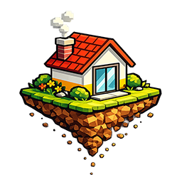

# mojdomek.eu – Home Assistant Integration

Integracja Home Assistant dla czujników poziomu cieczy serwisu **mojdomek.eu**. 
Pozwala na precyzyjne monitorowanie poziomu szamba, wody deszczowej oraz innych zbiorników bezpośrednio w Twoim inteligentnym domu.

## 🚀 Nowości w wersji 1.1.1
* **Usługa wymuszenia odświeżenia**: Nowa usługa `mojdomek_eu.refresh` pozwala na natychmiastowe pobranie danych z API (np. przyciskiem na dashboardzie) bez restartu integracji.
* **System Watchdog (v1.1.0)**: Możliwość zdefiniowania maksymalnego wieku danych. Jeśli dane w API są starsze niż limit, sensory przechodzą w stan `niedostępny`.
* **Sensor Binarny Statusu**: Diagnostyka poprawności danych w czasie rzeczywistym.

## 📦 Instalacja

### Przez HACS (Zalecane)
1. Otwórz **HACS** w Home Assistant.
2. Kliknij trzy kropki w prawym górnym rogu i wybierz **Custom repositories**.
3. Wklej link do tego repozytorium, wybierz kategorię **Integration** i kliknij **Add**.
4. Znajdź integrację `mojdomek.eu` i kliknij **Download**.
5. **Zrestartuj Home Assistant**.

### Konfiguracja
1. Przejdź do **Ustawienia** → **Urządzenia oraz usługi**.
2. Kliknij **Dodaj integrację** i wyszukaj `mojdomek.eu`.
3. Podaj **ID urządzenia** (znajdziesz je na obudowie czujnika lub w panelu mojdomek.eu).
4. Opcjonalnie dostosuj **Interwał odpytywania** oraz **Maksymalny wiek danych** w opcjach integracji.

---

## 🛠 Usługi (Services)

Integracja udostępnia usługę `mojdomek_eu.refresh`, która wymusza natychmiastową synchronizację danych z serwerem dla wszystkich skonfigurowanych urządzeń. Jest to idealne rozwiązanie, gdy chcesz ręcznie sprawdzić stan po opróżnieniu zbiornika bez czekania na automatyczny cykl odświeżania.

---

## 📊 Dostępne sensory

### Główne (Włączone domyślnie):
* **Poziom** [% i cm]
* **Temperatura** [°C]
* **Napięcie baterii** [V] oraz **Stan baterii** [%]
* **RSSI** [dBm] (Siła sygnału)
* **Ostatni pomiar** (Czas odczytu zarejestrowany przez serwer)
* **Statystyki**: Następne zapełnienie, Ostatnie opróżnienie

### Diagnostyka i Status:
* **Dane aktualne (Binary Sensor)**: Pokazuje, czy dane z API mieszczą się w Twoim limicie czasowym.
* **Informacje o urządzeniu**: Nazwa lokalizacji, wersja oprogramowania, typ zbiornika.

> Aby włączyć ukryte encje diagnostyczne, przejdź do urządzenia w HA, kliknij w nieaktywną encję i wybierz "Włącz encję".

---

## 🛠 Pomoc i wsparcie
Jeśli masz problem z działaniem integracji, otwórz zgłoszenie w sekcji **Issues** na tym repozytorium.

---
*Integracja nie jest oficjalnym produktem firmy mojdomek.eu, lecz narzędziem stworzonym przez społeczność.*
